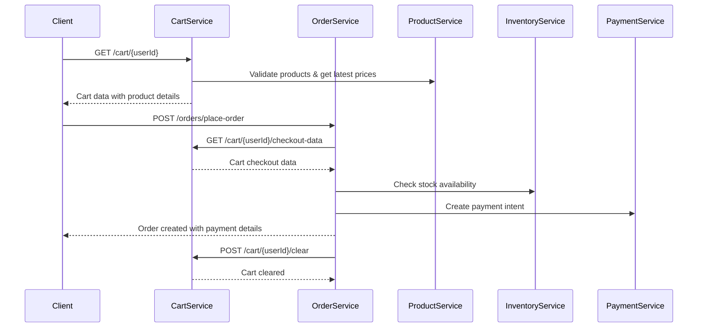

# Cart Service - Order Service Integration

## Tổng Quan
Tài liệu này mô tả cách kết hợp Cart Service với Order Service, bao gồm luồng dữ liệu, API design và cấu trúc dữ liệu trả về khi chuyển đổi từ giỏ hàng sang đơn hàng.

## Kiến Trúc Tích Hợp

### 1. Luồng Chuyển Đổi Cart → Order



## 2. API Design cho Cart Service

### 2.1 Endpoint: Lấy dữ liệu giỏ hàng cho checkout

```http
GET /api/v1/cart/{userId}/checkout-data
```

**Response Structure:**
```json
{
  "success": true,
  "data": {
    "cartId": "cart_123",
    "userId": 1001,
    "totalAmount": 250000,
    "totalQuantity": 5,
    "currency": "VND",
    "items": [
      {
        "productId": 1001,
        "productName": "iPhone 15 Pro",
        "price": 200000,
        "quantity": 1,
        "unit": "piece",
        "shopId": "shop_001",
        "discount": 0,
        "subtotal": 200000,
        "productImage": "https://example.com/iphone15.jpg",
        "productCategory": "Electronics",
        "isAvailable": true,
        "stockQuantity": 10
      },
      {
        "productId": 1002,
        "productName": "AirPods Pro",
        "price": 50000,
        "quantity": 1,
        "unit": "piece",
        "shopId": "shop_001",
        "discount": 5000,
        "subtotal": 45000,
        "productImage": "https://example.com/airpods.jpg",
        "productCategory": "Electronics",
        "isAvailable": true,
        "stockQuantity": 25
      }
    ],
    "shippingInfo": {
      "shippingMethod": "STANDARD",
      "shippingCost": 30000,
      "estimatedDelivery": "2024-01-15T10:00:00Z"
    },
    "discounts": [
      {
        "type": "COUPON",
        "code": "SAVE10",
        "amount": 25000,
        "description": "10% off for orders over 200k"
      }
    ],
    "summary": {
      "subtotal": 245000,
      "shippingCost": 30000,
      "discountAmount": 25000,
      "totalAmount": 250000,
      "taxAmount": 0
    },
    "metadata": {
      "createdAt": "2024-01-10T08:00:00Z",
      "lastModified": "2024-01-10T09:30:00Z",
      "cartState": "ACTIVE"
    }
  },
  "message": "Cart checkout data retrieved successfully"
}
```

### 2.2 Endpoint: Xóa giỏ hàng sau khi tạo order

```http
POST /api/v1/cart/{userId}/clear
```

**Request Body:**
```json
{
  "orderId": "order_456",
  "reason": "ORDER_CREATED"
}
```

**Response:**
```json
{
  "success": true,
  "message": "Cart cleared successfully",
  "data": {
    "cartId": "cart_123",
    "clearedAt": "2024-01-10T10:00:00Z",
    "orderId": "order_456"
  }
}
```

## 3. DTO Classes cho Cart Service

### 3.1 CartCheckoutResponse

```java
@Data
@Builder
public class CartCheckoutResponse {
    private String cartId;
    private Long userId;
    private Long totalAmount;
    private Integer totalQuantity;
    private Currency currency;
    private List<CartItemCheckoutResponse> items;
    private ShippingInfo shippingInfo;
    private List<DiscountInfo> discounts;
    private OrderSummary summary;
    private CartMetadata metadata;
}
```

### 3.2 CartItemCheckoutResponse

```java
@Data
@Builder
public class CartItemCheckoutResponse {
    private Long productId;
    private String productName;
    private Long price;
    private Integer quantity;
    private String unit;
    private String shopId;
    private Long discount;
    private Long subtotal;
    private String productImage;
    private String productCategory;
    private Boolean isAvailable;
    private Integer stockQuantity;
    private String productDescription;
    private List<String> productTags;
}
```

### 3.3 ShippingInfo

```java
@Data
@Builder
public class ShippingInfo {
    private String shippingMethod;
    private Long shippingCost;
    private Instant estimatedDelivery;
    private String shippingAddress;
    private String shippingNote;
}
```

### 3.4 DiscountInfo

```java
@Data
@Builder
public class DiscountInfo {
    private String type; // COUPON, PROMOTION, LOYALTY
    private String code;
    private Long amount;
    private String description;
    private String appliedTo; // PRODUCT, SHOP, ORDER
}
```

### 3.5 OrderSummary

```java
@Data
@Builder
public class OrderSummary {
    private Long subtotal;
    private Long shippingCost;
    private Long discountAmount;
    private Long taxAmount;
    private Long totalAmount;
    private String currency;
}
```

## 4. Service Implementation

### 4.1 CartService Interface Extension

```java
public interface CartService {
    // Existing methods...
    
    /**
     * Get cart data formatted for order creation
     */
    CartCheckoutResponse getCartCheckoutData(Long userId);
    
    /**
     * Clear cart after successful order creation
     */
    void clearCartAfterOrder(Long userId, String orderId);
    
    /**
     * Validate cart items before checkout
     */
    CartValidationResult validateCartForCheckout(Long userId);
}
```

### 4.2 CartServiceImpl Implementation

```java
@Service
@RequiredArgsConstructor
@Slf4j
public class CartServiceImpl implements CartService {
    
    private final CartRepository cartRepository;
    private final ProductServiceClient productServiceClient;
    private final InventoryServiceClient inventoryServiceClient;
    private final ShippingServiceClient shippingServiceClient;
    
    @Override
    public CartCheckoutResponse getCartCheckoutData(Long userId) {
        log.info("Getting cart checkout data for user: {}", userId);
        
        // 1. Get cart from database
        Cart cart = cartRepository.findByUserIdAndCartState(userId, CartState.ACTIVE)
            .orElseThrow(() -> new CartNotFoundException("Active cart not found for user: " + userId));
        
        // 2. Enrich cart items with product details
        List<CartItemCheckoutResponse> enrichedItems = enrichCartItems(cart.getCartItems());
        
        // 3. Calculate shipping cost
        ShippingInfo shippingInfo = calculateShippingInfo(cart, enrichedItems);
        
        // 4. Apply discounts
        List<DiscountInfo> discounts = applyDiscounts(cart, enrichedItems);
        
        // 5. Calculate summary
        OrderSummary summary = calculateOrderSummary(enrichedItems, shippingInfo, discounts);
        
        return CartCheckoutResponse.builder()
            .cartId(cart.getId())
            .userId(cart.getUserId())
            .totalAmount(summary.getTotalAmount())
            .totalQuantity(cart.getQuantity())
            .currency(Currency.VND)
            .items(enrichedItems)
            .shippingInfo(shippingInfo)
            .discounts(discounts)
            .summary(summary)
            .metadata(CartMetadata.builder()
                .createdAt(cart.getCreatedDate())
                .lastModified(cart.getLastModifiedDate())
                .cartState(cart.getCartState())
                .build())
            .build();
    }
    
    private List<CartItemCheckoutResponse> enrichCartItems(List<CartItem> cartItems) {
        return cartItems.stream()
            .map(this::enrichCartItem)
            .collect(Collectors.toList());
    }
    
    private CartItemCheckoutResponse enrichCartItem(CartItem cartItem) {
        // Call Product Service to get latest product details
        ProductResponse product = productServiceClient.getProduct(cartItem.getProductId());
        
        // Call Inventory Service to check stock
        InventoryResponse inventory = inventoryServiceClient.checkStock(
            cartItem.getProductId(), cartItem.getQuantity());
        
        Long subtotal = (cartItem.getPrice() - cartItem.getDiscount()) * cartItem.getQuantity();
        
        return CartItemCheckoutResponse.builder()
            .productId(cartItem.getProductId())
            .productName(product.getName())
            .price(cartItem.getPrice())
            .quantity(cartItem.getQuantity())
            .unit(product.getUnit())
            .shopId(cartItem.getShopId())
            .discount(cartItem.getDiscount())
            .subtotal(subtotal)
            .productImage(product.getImageUrl())
            .productCategory(product.getCategory())
            .isAvailable(inventory.isAvailable())
            .stockQuantity(inventory.getQuantity())
            .productDescription(product.getDescription())
            .productTags(product.getTags())
            .build();
    }
    
    @Override
    public void clearCartAfterOrder(Long userId, String orderId) {
        log.info("Clearing cart for user: {} after order: {}", userId, orderId);
        
        Cart cart = cartRepository.findByUserIdAndCartState(userId, CartState.ACTIVE)
            .orElseThrow(() -> new CartNotFoundException("Active cart not found"));
        
        cart.setCartState(CartState.COMPLETED);
        cart.setLastModifiedDate(Instant.now());
        
        cartRepository.save(cart);
        
        // Publish event for analytics
        eventPublisher.publishEvent(new CartClearedEvent(userId, cart.getId(), orderId));
    }
}
```

## 5. Order Service Integration

### 5.1 Order Service Client trong Cart Service

```java
@Component
@RequiredArgsConstructor
public class OrderServiceClient {
    
    private final RestTemplate restTemplate;
    private final String orderServiceUrl;
    
    public OrderResponse createOrderFromCart(CartCheckoutResponse cartData) {
        PlaceOrderRequest orderRequest = convertCartToOrderRequest(cartData);
        
        HttpHeaders headers = new HttpHeaders();
        headers.setContentType(MediaType.APPLICATION_JSON);
        
        HttpEntity<PlaceOrderRequest> request = new HttpEntity<>(orderRequest, headers);
        
        ResponseEntity<OrderResponse> response = restTemplate.postForEntity(
            orderServiceUrl + "/api/v1/orders/place-order",
            request,
            OrderResponse.class
        );
        
        return response.getBody();
    }
    
    private PlaceOrderRequest convertCartToOrderRequest(CartCheckoutResponse cartData) {
        List<OrderItemRequest> orderItems = cartData.getItems().stream()
            .map(item -> OrderItemRequest.builder()
                .productId(item.getProductId())
                .productName(item.getProductName())
                .quantity(item.getQuantity())
                .price(item.getPrice())
                .unit(item.getUnit())
                .build())
            .collect(Collectors.toList());
        
        return PlaceOrderRequest.builder()
            .customerId(cartData.getUserId())
            .amount(cartData.getTotalAmount())
            .currency(cartData.getCurrency())
            .paymentMethod(PaymentMethod.CREDIT_CARD) // Default or from request
            .orderItems(orderItems)
            .build();
    }
}
```

## 6. Error Handling

### 6.1 Custom Exceptions

```java
public class CartCheckoutException extends RuntimeException {
    private final String errorCode;
    private final Map<String, Object> details;
    
    public CartCheckoutException(String message, String errorCode, Map<String, Object> details) {
        super(message);
        this.errorCode = errorCode;
        this.details = details;
    }
}

public class CartValidationException extends RuntimeException {
    private final List<ValidationError> errors;
    
    public CartValidationException(String message, List<ValidationError> errors) {
        super(message);
        this.errors = errors;
    }
}
```

### 6.2 Error Response Structure

```json
{
  "success": false,
  "error": {
    "code": "CART_VALIDATION_FAILED",
    "message": "Cart validation failed",
    "details": {
      "unavailableItems": [
        {
          "productId": 1001,
          "productName": "iPhone 15 Pro",
          "reason": "OUT_OF_STOCK",
          "availableQuantity": 0,
          "requestedQuantity": 1
        }
      ],
      "priceChangedItems": [
        {
          "productId": 1002,
          "productName": "AirPods Pro",
          "oldPrice": 50000,
          "newPrice": 55000
        }
      ]
    }
  },
  "timestamp": "2024-01-10T10:00:00Z"
}
```

## 7. Caching Strategy

### 7.1 Cache Keys

```java
public class CacheKeys {
    public static final String CART_CHECKOUT_DATA = "cart:checkout:{userId}";
    public static final String PRODUCT_DETAILS = "product:details:{productId}";
    public static final String INVENTORY_STOCK = "inventory:stock:{productId}";
}
```

### 7.2 Cache Implementation

```java
@Service
@RequiredArgsConstructor
public class CartCheckoutCacheService {
    
    private final RedisTemplate<String, Object> redisTemplate;
    
    @Cacheable(value = "cartCheckout", key = "#userId")
    public CartCheckoutResponse getCachedCheckoutData(Long userId) {
        // Implementation to get from cache
    }
    
    @CacheEvict(value = "cartCheckout", key = "#userId")
    public void evictCheckoutCache(Long userId) {
        // Implementation to evict cache
    }
}
```

## 8. Monitoring & Metrics

### 8.1 Key Metrics

- **Cart to Order Conversion Rate**: Tỷ lệ chuyển đổi từ cart sang order
- **Checkout Data Response Time**: Thời gian phản hồi của API checkout data
- **Cart Validation Success Rate**: Tỷ lệ thành công của cart validation
- **Product Service Integration Latency**: Độ trễ khi gọi Product Service

### 8.2 Health Checks

```java
@Component
public class CartServiceHealthIndicator implements HealthIndicator {
    
    @Override
    public Health health() {
        try {
            // Check database connectivity
            // Check external service connectivity
            // Check cache connectivity
            
            return Health.up()
                .withDetail("database", "UP")
                .withDetail("productService", "UP")
                .withDetail("inventoryService", "UP")
                .build();
        } catch (Exception e) {
            return Health.down()
                .withDetail("error", e.getMessage())
                .build();
        }
    }
}
```

## 9. Testing Strategy

### 9.1 Unit Tests

```java
@ExtendWith(MockitoExtension.class)
class CartServiceImplTest {
    
    @Mock
    private CartRepository cartRepository;
    
    @Mock
    private ProductServiceClient productServiceClient;
    
    @InjectMocks
    private CartServiceImpl cartService;
    
    @Test
    void getCartCheckoutData_ShouldReturnValidResponse() {
        // Given
        Long userId = 1001L;
        Cart cart = createTestCart();
        
        when(cartRepository.findByUserIdAndCartState(userId, CartState.ACTIVE))
            .thenReturn(Optional.of(cart));
        
        // When
        CartCheckoutResponse response = cartService.getCartCheckoutData(userId);
        
        // Then
        assertThat(response).isNotNull();
        assertThat(response.getUserId()).isEqualTo(userId);
        assertThat(response.getItems()).hasSize(2);
    }
}
```

### 9.2 Integration Tests

```java
@SpringBootTest
@TestPropertySource(properties = {
    "spring.data.mongodb.uri=mongodb://localhost:27017/test-cart-db"
})
class CartOrderIntegrationTest {
    
    @Test
    void cartToOrderFlow_ShouldWorkEndToEnd() {
        // Test complete flow from cart to order
    }
}
```

## 10. Security Considerations

### 10.1 Authentication & Authorization

- Validate user ownership of cart
- Implement rate limiting for checkout endpoints
- Sanitize input data
- Use HTTPS for all communications

### 10.2 Data Protection

- Encrypt sensitive cart data
- Implement data retention policies
- Log access to cart data
- Implement audit trails

---

*Tài liệu này sẽ được cập nhật khi có thay đổi trong kiến trúc hoặc requirements.*